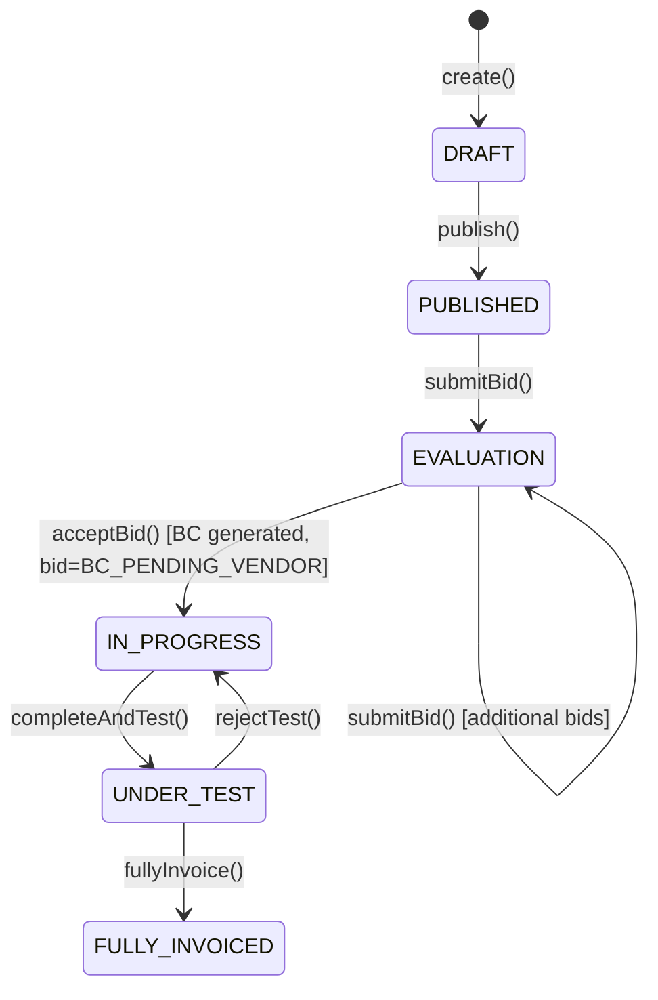
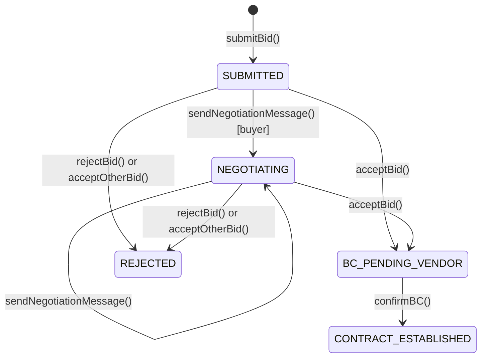
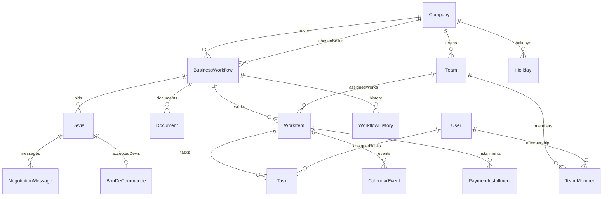

# Design Document — Contract & Bidding

## Overview

The Contract & Bidding feature closes the gap between the existing Effix backend (NestJS + TypeORM) and the full B2B procurement lifecycle that the frontend already mocks. The feature extends the `BusinessWorkflow` state machine, enriches the `Devis` (bid) entity, introduces `NegotiationMessage`, `WorkItem`, `Task`, `Team`, `TeamMember`, `Holiday`, `CalendarEvent`, and `PaymentInstallment` entities, and wires up all the REST endpoints that the frontend `WorkflowsView`, `WorkBoard`, `CalendarView`, `MessagesView`, and `TeamsView` components expect.

The design follows the existing architectural conventions: NestJS modules, TypeORM entities with STI where appropriate, repository interfaces with TypeORM implementations, service classes that own business logic, and controllers that delegate to services. All new modules are added to `crm_facturation_api/src/`.

---

## Architecture

The feature is organized into four new NestJS modules that extend the existing ones:

```
src/
├── marketplace/          (extended — new fields on BusinessWorkflow, new endpoints)
├── finance/              (extended — Devis.status, BonDeCommande.acceptedDevis FK)
├── contracting/          (NEW — NegotiationMessage, WorkItem, Task, PaymentInstallment)
├── teams/                (NEW — Team, TeamMember)
├── calendar/             (NEW — CalendarEvent, Holiday)
└── domain-services/      (extended — WorkItemStatusService, PaymentScheduleService)
```

### State Machine Overview



### Bid Status Lifecycle



---

## Components and Interfaces

### Extended: `BusinessWorkflow` Entity

New columns added to `business_workflows` table:

| Column | Type | Notes |
|---|---|---|
| `workflow_type` | `enum('material','service','subscription')` | Set at RFP creation |
| `region` | `varchar(255)` | Geographic scope |
| `requirements` | `simple-array` | List of requirement strings |
| `constraints` | `simple-array` | List of constraint strings |
| `conditions` | `text` | Contract conditions |
| `evaluation_criteria` | `text` | How bids will be evaluated |
| `contract_start_date` | `date` | Set when BC is confirmed |
| `contract_status` | `varchar(50)` | e.g. `ACTIVE`, `COMPLETED` |
| `progress_step_index` | `int` | Current step in the contract timeline |

### Extended: `Devis` Entity

New columns added to `financial_documents` table (STI child):

| Column | Type | Notes |
|---|---|---|
| `bid_status` | `enum('SUBMITTED','NEGOTIATING','BC_PENDING_VENDOR','CONTRACT_ESTABLISHED','REJECTED')` | Bid lifecycle status |
| `is_rejected` | `boolean` | Set when bid is rejected |
| `rejection_reason` | `text` | Reason for rejection |

### Extended: `BonDeCommande` Entity

New column added:

| Column | Type | Notes |
|---|---|---|
| `accepted_devis_id` | `int` (FK → `financial_documents.id`) | Links BC to the accepted bid |

### New: `NegotiationMessage` Entity (`negotiation_messages` table)

| Column | Type | Notes |
|---|---|---|
| `id` | `int` PK | |
| `bid_id` | `int` FK → `financial_documents.id` | The Devis this message belongs to |
| `workflow_id` | `int` FK → `business_workflows.id` | Denormalized for efficient querying |
| `sender_company_id` | `int` FK → `companies.id` | |
| `sender_user_id` | `int` FK → `users.id` | |
| `content` | `text` | Message body |
| `message_type` | `enum('BUYER_MESSAGE','VENDOR_MESSAGE','SYSTEM_NOTE')` | |
| `created_at` | `datetime` | Auto-set |

### New: `Team` Entity (`teams` table)

| Column | Type | Notes |
|---|---|---|
| `id` | `int` PK | |
| `name` | `varchar(255)` | |
| `description` | `text` | |
| `manager_id` | `int` FK → `users.id` | |
| `company_id` | `int` FK → `companies.id` | |
| `tags` | `simple-array` | |
| `created_at` | `datetime` | Auto-set |

### New: `TeamMember` Entity (`team_members` table)

| Column | Type | Notes |
|---|---|---|
| `id` | `int` PK | |
| `team_id` | `int` FK → `teams.id` | |
| `user_id` | `int` FK → `users.id` | |
| `joined_at` | `datetime` | Auto-set |

### New: `WorkItem` Entity (`work_items` table)

| Column | Type | Notes |
|---|---|---|
| `id` | `int` PK | |
| `workflow_id` | `int` FK → `business_workflows.id` | |
| `title` | `varchar(255)` | |
| `description` | `text` | |
| `type` | `enum('material','service','subscription')` | |
| `status` | `enum('PENDING','IN_PROGRESS','COMPLETED')` | Derived from tasks |
| `assigned_team_id` | `int` FK → `teams.id`, nullable | |
| `start_date` | `date` | |
| `end_date` | `date` | |
| `monthly_amount` | `decimal(15,2)` | Only for subscription type |
| `created_at` | `datetime` | Auto-set |

### New: `Task` Entity (`tasks` table)

| Column | Type | Notes |
|---|---|---|
| `id` | `int` PK | |
| `work_item_id` | `int` FK → `work_items.id` | |
| `title` | `varchar(255)` | |
| `description` | `text` | |
| `status` | `enum('todo','in-progress','completed')` | |
| `assignee_user_id` | `int` FK → `users.id`, nullable | |
| `due_date` | `date` | |
| `duration_days` | `int` default 1 | |
| `comments` | `json` | Array of `{ author, text, timestamp }` |
| `attachments` | `json` | Array of `{ id, name, size, type, url }` |
| `created_at` | `datetime` | Auto-set |

### New: `Holiday` Entity (`holidays` table)

| Column | Type | Notes |
|---|---|---|
| `id` | `int` PK | |
| `company_id` | `int` FK → `companies.id` | |
| `date` | `date` | |
| `label` | `varchar(255)` | |

### New: `CalendarEvent` Entity (`calendar_events` table)

| Column | Type | Notes |
|---|---|---|
| `id` | `int` PK | |
| `work_item_id` | `int` FK → `work_items.id` | |
| `workflow_id` | `int` FK → `business_workflows.id` | Denormalized |
| `event_type` | `enum('PACKAGING','DEPARTURE','ARRIVAL','SERVICE_DAY','BILLING_CYCLE')` | |
| `event_date` | `date` | |
| `has_conflict` | `boolean` default false | |
| `conflicting_work_item_ids` | `simple-array` | IDs of conflicting work items |

### New: `PaymentInstallment` Entity (`payment_installments` table)

| Column | Type | Notes |
|---|---|---|
| `id` | `int` PK | |
| `work_item_id` | `int` FK → `work_items.id` | |
| `due_date` | `date` | First business day of the month |
| `amount` | `decimal(15,2)` | |
| `status` | `enum('PENDING','PAID','OVERDUE')` | |
| `paid_at` | `datetime` | Nullable |

---

## Data Models

### Entity Relationship Diagram



### Enum Definitions

```typescript
// New enums to add
export enum WorkflowType {
  MATERIAL = 'material',
  SERVICE = 'service',
  SUBSCRIPTION = 'subscription',
}

export enum BidStatus {
  SUBMITTED = 'SUBMITTED',
  NEGOTIATING = 'NEGOTIATING',
  BC_PENDING_VENDOR = 'BC_PENDING_VENDOR',
  CONTRACT_ESTABLISHED = 'CONTRACT_ESTABLISHED',
  REJECTED = 'REJECTED',
}

export enum NegotiationMessageType {
  BUYER_MESSAGE = 'BUYER_MESSAGE',
  VENDOR_MESSAGE = 'VENDOR_MESSAGE',
  SYSTEM_NOTE = 'SYSTEM_NOTE',
}

export enum WorkItemStatus {
  PENDING = 'PENDING',
  IN_PROGRESS = 'IN_PROGRESS',
  COMPLETED = 'COMPLETED',
}

export enum WorkItemType {
  MATERIAL = 'material',
  SERVICE = 'service',
  SUBSCRIPTION = 'subscription',
}

export enum TaskStatus {
  TODO = 'todo',
  IN_PROGRESS = 'in-progress',
  COMPLETED = 'completed',
}

export enum CalendarEventType {
  PACKAGING = 'PACKAGING',
  DEPARTURE = 'DEPARTURE',
  ARRIVAL = 'ARRIVAL',
  SERVICE_DAY = 'SERVICE_DAY',
  BILLING_CYCLE = 'BILLING_CYCLE',
}

export enum InstallmentStatus {
  PENDING = 'PENDING',
  PAID = 'PAID',
  OVERDUE = 'OVERDUE',
}
```

### Key Domain Service Interfaces

```typescript
// WorkItemStatusService — pure function, no I/O
interface WorkItemStatusService {
  derive(tasks: { status: TaskStatus }[]): WorkItemStatus;
}

// PaymentScheduleService — pure function, no I/O
interface PaymentScheduleService {
  generate(startDate: Date, endDate: Date, monthlyAmount: number): PaymentInstallmentDto[];
  firstBusinessDayOfMonth(year: number, month: number): Date;
}

// CalendarConflictService — pure function, no I/O
interface CalendarConflictService {
  detectMaterialConflicts(workItems: WorkItem[], companyId: number): Map<number, number[]>;
  detectServiceConflicts(workItems: WorkItem[], holidays: Date[], companyId: number): Map<number, number[]>;
  getBusinessDays(startDate: Date, endDate: Date, holidays: Date[]): Date[];
}
```

---

## API Endpoints

### Marketplace / RFP Endpoints

| Method | Path | Description |
|---|---|---|
| `POST` | `/workflows` | Create RFP (extended with new fields) |
| `GET` | `/workflows` | List workflows (supports `?mine=true`) |
| `GET` | `/workflows/active` | List PUBLISHED RFPs (supports filters) |
| `GET` | `/workflows/contracts` | List active contracts for authenticated company |
| `POST` | `/workflows/:id/publish` | Publish RFP |
| `GET` | `/workflows/:id` | Get workflow detail |
| `GET` | `/workflows/:id/contract` | Get full contract detail |
| `PATCH` | `/workflows/:id/contract/progress` | Advance contract progress step |
| `GET` | `/workflows/:id/history` | Get workflow history |

### Bid Endpoints

| Method | Path | Description |
|---|---|---|
| `POST` | `/workflows/:id/bids` | Submit a bid |
| `GET` | `/workflows/:id/bids` | List all bids on a workflow (buyer only) |
| `POST` | `/workflows/:id/bids/accept` | Accept a bid (generates BC) |
| `POST` | `/workflows/:id/bids/:bidId/reject` | Reject a specific bid |
| `GET` | `/bids/mine` | List all bids submitted by authenticated company |
| `GET` | `/bids/:bidId` | Get full bid detail with negotiation thread |

### Negotiation Endpoints

| Method | Path | Description |
|---|---|---|
| `POST` | `/workflows/:id/bids/:bidId/messages` | Send a negotiation message |
| `GET` | `/workflows/:id/bids/:bidId/messages` | Get negotiation thread for a bid |

### BC / Contract Endpoints

| Method | Path | Description |
|---|---|---|
| `POST` | `/workflows/:id/bc/confirm` | Seller confirms BC → CONTRACT_ESTABLISHED |

### Work Item Endpoints

| Method | Path | Description |
|---|---|---|
| `POST` | `/workflows/:id/works` | Create a Work Item |
| `GET` | `/workflows/:id/works` | List Work Items for a contract |
| `GET` | `/works/:workId` | Get Work Item with tasks |
| `PATCH` | `/works/:workId` | Update Work Item |
| `POST` | `/works/:workId/tasks` | Add a task to a Work Item |
| `GET` | `/works/:workId/tasks` | List tasks grouped by status |
| `PATCH` | `/works/:workId/tasks/:taskId` | Update a task |
| `DELETE` | `/works/:workId/tasks/:taskId` | Delete a task |
| `POST` | `/works/:workId/tasks/:taskId/comments` | Add a comment to a task |

### Team Endpoints

| Method | Path | Description |
|---|---|---|
| `POST` | `/teams` | Create a team |
| `GET` | `/teams` | List teams for authenticated company |
| `GET` | `/teams/:id` | Get team with members and assigned Work Items |
| `PATCH` | `/teams/:id` | Update team details |
| `POST` | `/teams/:id/members` | Add a member to a team |
| `DELETE` | `/teams/:id/members/:userId` | Remove a member from a team |

### Calendar Endpoints

| Method | Path | Description |
|---|---|---|
| `GET` | `/calendar/events` | Get calendar events (supports `?from=&to=`) |
| `POST` | `/holidays` | Create a holiday |
| `GET` | `/holidays` | List holidays for authenticated company |

### Payment Schedule Endpoints

| Method | Path | Description |
|---|---|---|
| `GET` | `/works/:workId/payment-schedule` | Get payment installments |
| `PATCH` | `/works/:workId/payment-schedule/:installmentId` | Mark installment as PAID |

---

## Correctness Properties

*A property is a characteristic or behavior that should hold true across all valid executions of a system — essentially, a formal statement about what the system should do. Properties serve as the bridge between human-readable specifications and machine-verifiable correctness guarantees.*

### Property 1: Bid Total Calculation Invariant

*For any* array of `DocumentItem` records with valid `unitPriceHT`, `quantity`, `discountAmount`, and `appliedTvaRate` values, the `InvoiceCalculatorService.applyTotals()` method SHALL produce a `totalTTC` that equals `subTotalHT + totalTVA`, where `subTotalHT = Σ max(0, unitPriceHT × quantity − discountAmount) × (1 − globalDiscountRate/100)` and `totalTVA = Σ lineHT × tvaRate/100 × (1 − globalDiscountRate/100)`.

**Validates: Requirements 2.5**

### Property 2: Work Item Status Derivation Invariant

*For any* non-empty array of `Task` records, the `WorkItemStatusService.derive()` function SHALL return:
- `COMPLETED` if and only if every task has `status = completed`
- `PENDING` if and only if every task has `status = todo`
- `IN_PROGRESS` in all other cases (any mix of statuses, or any task with `status = in-progress`)

This invariant must hold after every task status mutation.

**Validates: Requirements 6.5, 6.6, 14.4**

### Property 3: Payment Schedule Completeness and Weekend-Free Due Dates

*For any* subscription Work Item with a valid `startDate`, `endDate` (where `endDate > startDate`), and positive `monthlyAmount`, the `PaymentScheduleService.generate()` function SHALL produce exactly `ceil(months_between(startDate, endDate))` installments, and no installment's `dueDate` SHALL fall on a Saturday (day 6) or Sunday (day 0).

**Validates: Requirements 10.1, 10.2, Property 3**

### Property 4: Calendar Conflict Detection Correctness

*For any* pair of Work Items assigned to the same seller company:
- If their date ranges overlap (for `material` type) or their business-day sets intersect (for `service` type), both Work Items SHALL have `hasConflict = true` in the calendar event response.
- If their date ranges do not overlap, both SHALL have `hasConflict = false`.

*For any* pair of Work Items where the authenticated company is the buyer (not the seller), `hasConflict` SHALL always be `false` regardless of date overlap.

**Validates: Requirements 8.3, 8.4, 9.3, 9.4, Property 4**

### Property 5: Negotiation Message Thread Integrity

*For any* bid with N persisted `NegotiationMessage` records, the `GET /workflows/:id/bids/:bidId/messages` endpoint SHALL return exactly N messages, all ordered by `createdAt` ascending, and every returned message SHALL have `bidId` equal to the requested `bidId` (no cross-bid leakage).

**Validates: Requirements 3.4, Property 5**

### Property 6: State Machine Monotonicity

*For any* `BusinessWorkflow` in state `S`, applying any transition method that would result in a state earlier in the canonical order (`DRAFT < PUBLISHED < EVALUATION < IN_PROGRESS < UNDER_TEST < FULLY_INVOICED`) SHALL throw an error and leave `stateCode` unchanged, with the single exception of `rejectTest()` which is permitted to move `UNDER_TEST → IN_PROGRESS`.

**Validates: Requirements 17.1, 17.2, 17.5, Property 6**

### Property 7: BC Reference Number Uniqueness

*For any* two distinct `BonDeCommande` records created by the system, their `clientPoReferenceNumber` values SHALL be different. The generation strategy `BC-{YEAR}-{workflowId}-{sequence}` combined with a database-level unique constraint SHALL guarantee this across concurrent creation.

**Validates: Requirements 4.2, Property 7**

---

## Error Handling

### HTTP Error Mapping

| Condition | HTTP Status | Error Code |
|---|---|---|
| Workflow not found | 404 | `WORKFLOW_NOT_FOUND` |
| Bid not found | 404 | `BID_NOT_FOUND` |
| Work Item not found | 404 | `WORK_ITEM_NOT_FOUND` |
| Team not found | 404 | `TEAM_NOT_FOUND` |
| Self-bid prevention | 400 | `SELF_BID_NOT_ALLOWED` |
| Bid on wrong state workflow | 400 | `INVALID_WORKFLOW_STATE` |
| Insufficient inventory | 400 | `INSUFFICIENT_STOCK` |
| Work Item on non-IN_PROGRESS workflow | 400 | `WORKFLOW_NOT_IN_PROGRESS` |
| Team belongs to wrong company | 400 | `TEAM_COMPANY_MISMATCH` |
| Assignee belongs to wrong company | 400 | `ASSIGNEE_COMPANY_MISMATCH` |
| Unauthorized publish | 403 | `FORBIDDEN_PUBLISH` |
| Unauthorized BC confirm | 403 | `FORBIDDEN_BC_CONFIRM` |
| Unauthorized negotiation message access | 403 | `FORBIDDEN_NEGOTIATION_ACCESS` |
| Unauthorized bid list access | 403 | `FORBIDDEN_BID_LIST` |
| Unauthorized history access | 403 | `FORBIDDEN_HISTORY` |
| Invalid state transition | 400 | `INVALID_STATE_TRANSITION` |

### Guard Strategy

All state machine transitions are guarded at the service layer using the existing `WorkflowState` pattern. New guards are added for:

1. **Bid submission guard**: `stateCode IN (PUBLISHED, EVALUATION)` — throws `BadRequestException` otherwise.
2. **Bid acceptance guard**: `stateCode === EVALUATION` — throws `BadRequestException` otherwise.
3. **Work Item creation guard**: `stateCode === IN_PROGRESS` — throws `BadRequestException` otherwise.
4. **BC confirmation guard**: `chosenSellerCompany.id === actorCompanyId` — throws `ForbiddenException` otherwise.
5. **Negotiation message guard**: `actorCompanyId IN (buyerCompany.id, bid.biddingSeller.id)` — throws `ForbiddenException` otherwise.

### Transaction Boundaries

All multi-entity writes use `DataSource.transaction()`:
- `acceptBid()`: updates Devis statuses + creates BonDeCommande + saves WorkflowHistory in one transaction.
- `confirmBC()`: updates BonDeCommande + updates Devis status + updates BusinessWorkflow contract fields + saves WorkflowHistory in one transaction.
- `createWorkItem()`: saves WorkItem + generates CalendarEvents + generates PaymentInstallments (if subscription) in one transaction.
- `updateTaskStatus()`: updates Task + recomputes WorkItem status in one transaction.

---

## Testing Strategy

### Dual Testing Approach

Both unit/example-based tests and property-based tests are used. Unit tests cover specific scenarios, edge cases, and integration points. Property tests verify universal invariants across randomized inputs.

### Property-Based Testing Library

The project uses **TypeScript/Node.js**, so property-based tests use **[fast-check](https://github.com/dubzzz/fast-check)** (the standard PBT library for the JS/TS ecosystem). Each property test runs a minimum of **100 iterations**.

Each property test is tagged with a comment in the format:
```
// Feature: contract-and-bidding, Property N: <property_text>
```

### Property Test Specifications

**Property 1 — Bid Total Calculation Invariant**
```typescript
// Feature: contract-and-bidding, Property 1: totalTTC = subTotalHT + totalTVA for any item array
fc.assert(fc.property(
  fc.array(arbitraryDocumentItem(), { minLength: 1, maxLength: 20 }),
  fc.float({ min: 0, max: 50 }),  // globalDiscountPercentage
  (items, globalDiscount) => {
    const doc = { items, globalDiscountPercentage: globalDiscount, subTotalHT: 0, totalTVA: 0, totalTTC: 0 };
    calculator.applyTotals(doc);
    return Math.abs(doc.totalTTC - (doc.subTotalHT + doc.totalTVA)) < 0.001;
  }
), { numRuns: 100 });
```

**Property 2 — Work Item Status Derivation**
```typescript
// Feature: contract-and-bidding, Property 2: WorkItem status derived correctly from task statuses
fc.assert(fc.property(
  fc.array(arbitraryTask(), { minLength: 1, maxLength: 50 }),
  (tasks) => {
    const derived = workItemStatusService.derive(tasks);
    const allCompleted = tasks.every(t => t.status === 'completed');
    const allTodo = tasks.every(t => t.status === 'todo');
    if (allCompleted) return derived === WorkItemStatus.COMPLETED;
    if (allTodo) return derived === WorkItemStatus.PENDING;
    return derived === WorkItemStatus.IN_PROGRESS;
  }
), { numRuns: 100 });
```

**Property 3 — Payment Schedule Completeness**
```typescript
// Feature: contract-and-bidding, Property 3: payment schedule has ceil(months) installments, no weekend due dates
fc.assert(fc.property(
  arbitrarySubscriptionDateRange(),
  fc.float({ min: 1, max: 100000 }),
  ({ startDate, endDate }, monthlyAmount) => {
    const installments = paymentScheduleService.generate(startDate, endDate, monthlyAmount);
    const expectedCount = Math.ceil(monthsBetween(startDate, endDate));
    const noWeekends = installments.every(i => {
      const day = i.dueDate.getDay();
      return day !== 0 && day !== 6;
    });
    return installments.length === expectedCount && noWeekends;
  }
), { numRuns: 100 });
```

**Property 4 — Calendar Conflict Detection**
```typescript
// Feature: contract-and-bidding, Property 4: overlapping seller work items have hasConflict=true, non-overlapping have false
fc.assert(fc.property(
  arbitraryWorkItemPair(),
  ({ workItem1, workItem2, sellerCompanyId }) => {
    const events = calendarConflictService.detectMaterialConflicts([workItem1, workItem2], sellerCompanyId);
    const overlaps = datesOverlap(workItem1.startDate, workItem1.endDate, workItem2.startDate, workItem2.endDate);
    const conflict1 = (events.get(workItem1.id)?.length ?? 0) > 0;
    const conflict2 = (events.get(workItem2.id)?.length ?? 0) > 0;
    return overlaps ? (conflict1 && conflict2) : (!conflict1 && !conflict2);
  }
), { numRuns: 100 });
```

**Property 5 — Negotiation Message Thread Integrity**
```typescript
// Feature: contract-and-bidding, Property 5: message thread returns exactly N messages ordered by createdAt, no cross-bid leakage
fc.assert(fc.property(
  fc.array(arbitraryNegotiationMessage(), { minLength: 1, maxLength: 30 }),
  fc.integer({ min: 1, max: 1000 }),  // targetBidId
  (messages, targetBidId) => {
    const thread = filterAndSortThread(messages, targetBidId);
    const onlyTargetBid = thread.every(m => m.bidId === targetBidId);
    const ordered = thread.every((m, i) => i === 0 || m.createdAt >= thread[i - 1].createdAt);
    const correctCount = thread.length === messages.filter(m => m.bidId === targetBidId).length;
    return onlyTargetBid && ordered && correctCount;
  }
), { numRuns: 100 });
```

**Property 6 — State Machine Monotonicity**
```typescript
// Feature: contract-and-bidding, Property 6: state machine only advances forward (except rejectTest UNDER_TEST→IN_PROGRESS)
fc.assert(fc.property(
  arbitraryWorkflowState(),
  arbitraryBackwardTransition(),
  (currentState, backwardTransition) => {
    const wf = new BusinessWorkflow({ stateCode: currentState });
    try {
      applyTransition(wf, backwardTransition);
      return false; // Should have thrown
    } catch {
      return wf.stateCode === currentState; // State unchanged
    }
  }
), { numRuns: 100 });
```

**Property 7 — BC Reference Number Uniqueness**
```typescript
// Feature: contract-and-bidding, Property 7: BC reference numbers are unique across all generated BCs
fc.assert(fc.property(
  fc.array(arbitraryBCGenerationInput(), { minLength: 2, maxLength: 20 }),
  (inputs) => {
    const refs = inputs.map(i => generateBCReference(i.year, i.workflowId, i.sequence));
    const unique = new Set(refs);
    return unique.size === refs.length;
  }
), { numRuns: 100 });
```

### Unit Test Coverage

Unit tests (using Jest, the existing test runner) cover:

- **Authorization guards**: Each 403/400 guard condition with concrete examples.
- **State transitions**: Each valid and invalid transition with concrete examples.
- **BC generation**: Reference number format, field copying from Devis.
- **Notification triggers**: Each of the 8 notification events.
- **Bid revision numbering**: Incrementing `revisionNumber` on re-submission.
- **Self-bid prevention**: HTTP 400 when buyer submits bid on own RFP.
- **Inventory check**: HTTP 400 when material bid accepted with insufficient stock.
- **Contract timeline**: Correct timeline steps returned for each `workflowType`.
- **Overdue installment**: Status transition to OVERDUE when dueDate is past.

### Integration Test Coverage

Integration tests (using Jest + TypeORM in-memory SQLite or test database) cover:

- Full bid lifecycle: create RFP → publish → submit bid → accept bid → confirm BC → create work items.
- Negotiation thread: post messages from both sides, verify ordering and isolation.
- Calendar event generation: create material/service/subscription work items, verify events.
- Payment schedule: create subscription work item, verify installment count and dates.
- History audit trail: verify a history record is created for every state transition.
